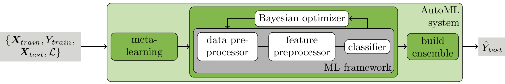

# auto-sklearn

**auto-sklearn** is an automated machine learning toolkit and a drop-in replacement for a [scikit-learn](https://scikit-learn.org) estimator.

Find the documentation **[here](https://automl.github.io/auto-sklearn/)**. Quick links:
  * [Installation Guide](https://automl.github.io/auto-sklearn/master/installation.html)
  * [Releases](https://automl.github.io/auto-sklearn/master/releases.html)
  * [Manual](https://automl.github.io/auto-sklearn/master/manual.html)
  * [Examples](https://automl.github.io/auto-sklearn/master/examples/index.html)
  * [API](https://automl.github.io/auto-sklearn/master/api.html)

## auto-sklearn in one image



## auto-sklearn in four lines of code

```python
import autosklearn.classification
cls = autosklearn.classification.AutoSklearnClassifier()
cls.fit(X_train, y_train)
predictions = cls.predict(X_test)
```

## Relevant publications

If you use auto-sklearn in scientific publications, we would appreciate citations.

**Efficient and Robust Automated Machine Learning**  
*Matthias Feurer, Aaron Klein, Katharina Eggensperger, Jost Springenberg, Manuel Blum and Frank Hutter*  
Advances in Neural Information Processing Systems 28 (2015)  

[Link](https://papers.nips.cc/paper/5872-efficient-and-robust-automated-machine-learning.pdf) to publication.
```
@inproceedings{feurer-neurips15a,
  title     = {Efficient and Robust Automated Machine Learning},
  author    = {Matthias Feurer, Aaron Klein, Katharina Eggensperger, Jost Springenberg, Manuel Blum and Frank Hutter},
  booktitle = {Advances in Neural Information Processing Systems 28 (2015)},
  pages     = {2962--2970},
  year      = {2015}
}
```

----------------------------------------

**Auto-Sklearn 2.0: The Next Generation**  
*Matthias Feurer, Katharina Eggensperger, Stefan Falkner, Marius Lindauer and Frank Hutter**  
arXiv:2007.04074 [cs.LG], 2020

[Link](https://arxiv.org/abs/2007.04074) to publication.
```
@inproceedings{feurer-arxiv20a,
  title     = {Auto-Sklearn 2.0: The Next Generation},
  author    = {Matthias Feurer, Katharina Eggensperger, Stefan Falkner, Marius Lindauer and Frank Hutter},
  booktitle = {arXiv:2007.04074 [cs.LG]},
  year      = {2020}
}
```

----------------------------------------

Also, have a look at the blog on [automl.org](https://automl.org) where we regularly release blogposts.
